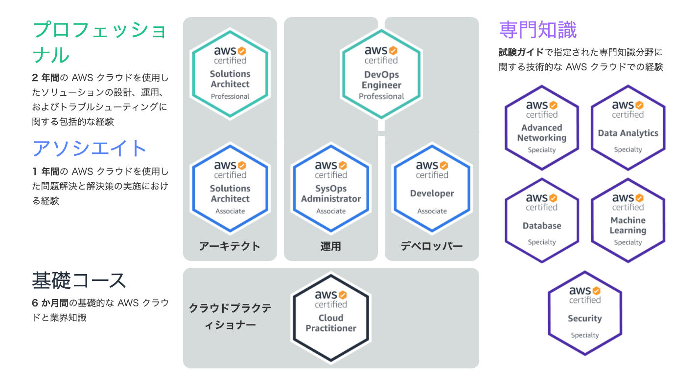
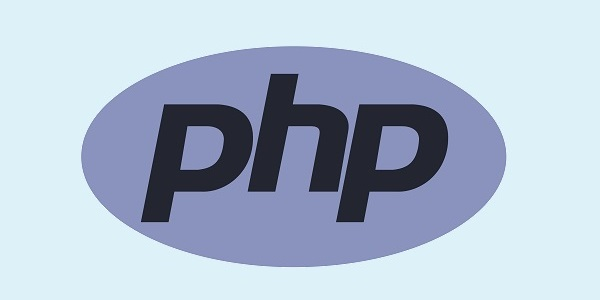

# Certificate

## 情報処理技術者試験

### About Test

### Test's List

- [IT パスポート試験]
- [情報セキュリティマネジメント試験]
- [基本情報技術者試験]
- [応用情報技術者試験]
- [IT ストラテジスト試験]
- [システムアーキテクト試験]
- [プロジェクトマネージャー試験]
- [ネットワークスペシャリスト試験]
- [データベーススペシャリスト試験]
- [エンデッドシステムスペシャリスト試験]
- [IT サービスマネージャ試験]
- [システム監査技術者試験]
- [情報処理安全確保支援士試験]
- [情報処理安全確保支援士]

 

---

## AWS

### About Test

 

---

## PHP 技術者認定試験

### About Test

> PHP のレベルを評価するテスト。　　　  
> 試験のレベルは初級・上級と分かれている。
>
> > 初級は学生、または社会人 1 ～ 2 年目のレベル 　　　　　　　　
> > 上級は実用的かつ高度なプログラミングテクニックを持つ上級者

 

---

## Reference

- [ProEngineer - 就職＆転職に役立つおすすめプログラミング資格一覧](https://proengineer.internous.co.jp/content/columnfeature/4550)
