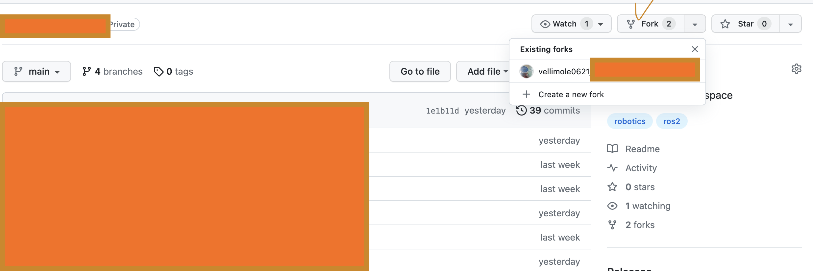

# GIT Pull Request

A pull request – also referred to as a merge request – is an event that takes place in software development when a contributor/developer is ready to begin the process of merging new code changes with the main project repository. 
      
<br>

## Fork

타켓 프로젝트의 저장소에 가서 Fork 한다.




이후 새로운 저장소가 생성된다.

<br>
    
## clone, remote

새로 생긴 저장소의 주소로 clone 한다.

```
git clone https://github.com/~ # 새로 생긴 저장소의 주소
```

<br>

clone 된 디렉토리에서 fork한 기존 프로젝트를 원격 저장소로 추가한다.   


```
# 원본 프로젝트 저장소를 원격 저장소로 추가
git remote add [별명] https://github.com/~ # 원본 저장소 주소

# 원격 저장소 설정 현황 확인방법
$ git remote -v
```

<br>

## Branch 생성


코드를 독립적으로 개발하기 위해서 branch를 생성한다.

```
# new_branch 이라는 이름의 branch를 생성한다.
git checkout -b new_branch
Switched to a new branch 'new_branch'

# 기존 main branch 이외에 new_branch가 생성되었다.
git branch
* new_branch
  main
```

<br>

## 개발 작업 후 add, commit, push

개발이 끝난 후, add, commit, push를 거쳐 해당 코드를 업로드한다.

```
# new_branch 브랜치의 수정 내역을 origin 으로 푸시한다.
$ git push origin new_branch
```

<br>

## Pull Request 생성

push 완료 후 본인 계정의 github 저장소에 들어오면 Compare & pull reqeust 버튼이 활성화 되어 있다.

해당 버튼을 눌러. Pull Request를 생성한다.


<br>

## Merge 이후 동기화 및 branch 삭제

해당 Pull Request가 관리자에 의해 Merge 되면.

동기화 시킨 뒤. 작업한 Branch를 삭제해준다.

```
# 코드 동기화
git pull (remote 별명)

# 브랜치 삭제
git branch -d new_branch(브랜치 별명)
```

<br>

이후 원본 저장소와 동기화가 필요한 경우. fork한 저장소의 sync 버튼을 눌러 원격 저장소를 동기화 시키고.   
아래와 같이 로컬 저장소도 동기화 시킨다..

```
git pull (remote 별명)
```


### Reference : https://wayhome25.github.io/git/2017/07/08/git-first-pull-request-story/