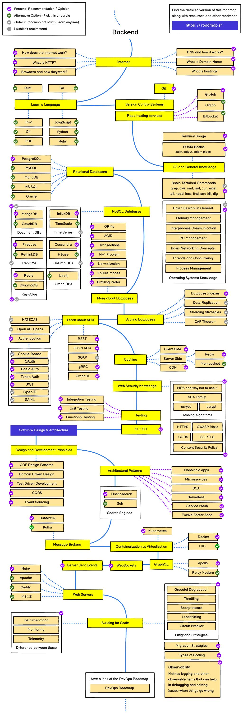

# キム・ヒョンギュの Programming

Langugage & Framework

- [Django](Django/Django_index.md)

- [Python](Python/Python_index.md)

- [PHP](PHP/PHP_index.md)

---

Computer Science

---

資格

## [Certificate](Certificate/Certificate_index.md)

- [基本情報技術者](/Programming/CS_hk/Certificate/%E5%9F%BA%E6%9C%AC%E6%83%85%E5%A0%B1%E6%8A%80%E8%A1%93%E8%80%85%E8%A9%A6%E9%A8%93/Basic_info_test_index.md)
- AWS

---

Backend Road map From roadmap.sh "https://roadmap.sh/backend"

  

